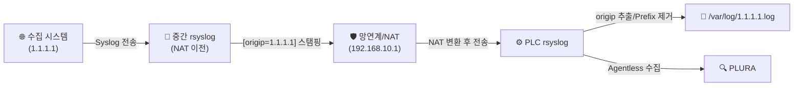
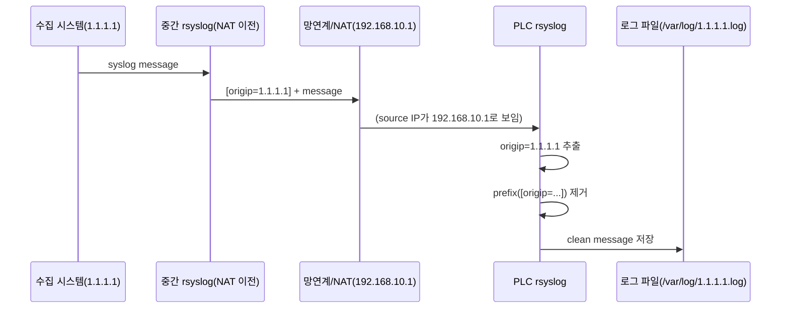

## Rsyslog NAT 환경에서 원본 IP 보존 설계

## 개요

망연계(NAT) 환경을 거치는 경우,  
로그 수집 서버에서는 실제 송신자 IP가 아닌 변환된 IP가 기록됩니다.

예시:

(수집 시스템) 1.1.1.1  
→ (망연계) 192.168.10.1  
→ PLC (rsyslog)  
→ PLURA

이 경우 PLC에는 다음과 같이 저장됩니다:

```

/var/log/192.168.10.1.log

```

실제 원본 시스템(1.1.1.1)을 식별할 수 없습니다.

---

## 해결 방법

### 핵심 아이디어

망연계 이전 구간에서 원본 IP를 메시지에 포함시킵니다.

예:

```

[origip=1.1.1.1] user login failed

```

PLC rsyslog는 이 값을 추출하여:

- 파일명: `/var/log/1.1.1.1.log`
- 로그 본문에서는 `[origip=...]` 제거 후 저장

---

## 동작 흐름

```

1.1.1.1 → rsyslog (origip 추가)
→ NAT (IP 변경)
→ PLC rsyslog (origip 기반 동적 파일 생성)

```

---


## 구성도 (Mermaid)

### 전체 흐름



### 메시지 변환 예시



---

## PLC rsyslog 구성 핵심

1. 메시지에서 `origip` 추출
2. Dynamic File Template 사용
3. prefix 제거 후 저장

---

## 기대 효과

- NAT 환경에서도 원본 시스템 식별 가능
- 파일명 기반 시스템 구분 유지
- 기존 구조 변경 최소화
- PLURA 연동 시 정확한 시스템 매핑 가능

---

## 주의 사항

- 반드시 NAT 이전 구간에서 origip를 삽입해야 함
- prefix 형식은 고정 권장 (`[origip=IP]`)
- UDP 대신 TCP/RELP 사용 권장

---

## 결론

NAT 환경에서는 네트워크 레벨에서 원본 IP 복구가 불가능합니다.  
따라서 애플리케이션 레벨에서 원본 정보를 메시지에 포함시키는 방식이 가장 안정적입니다.

---
